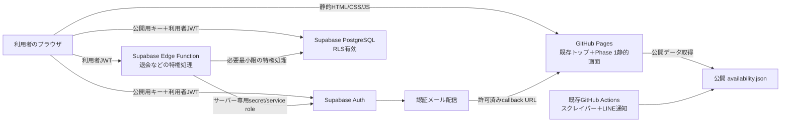
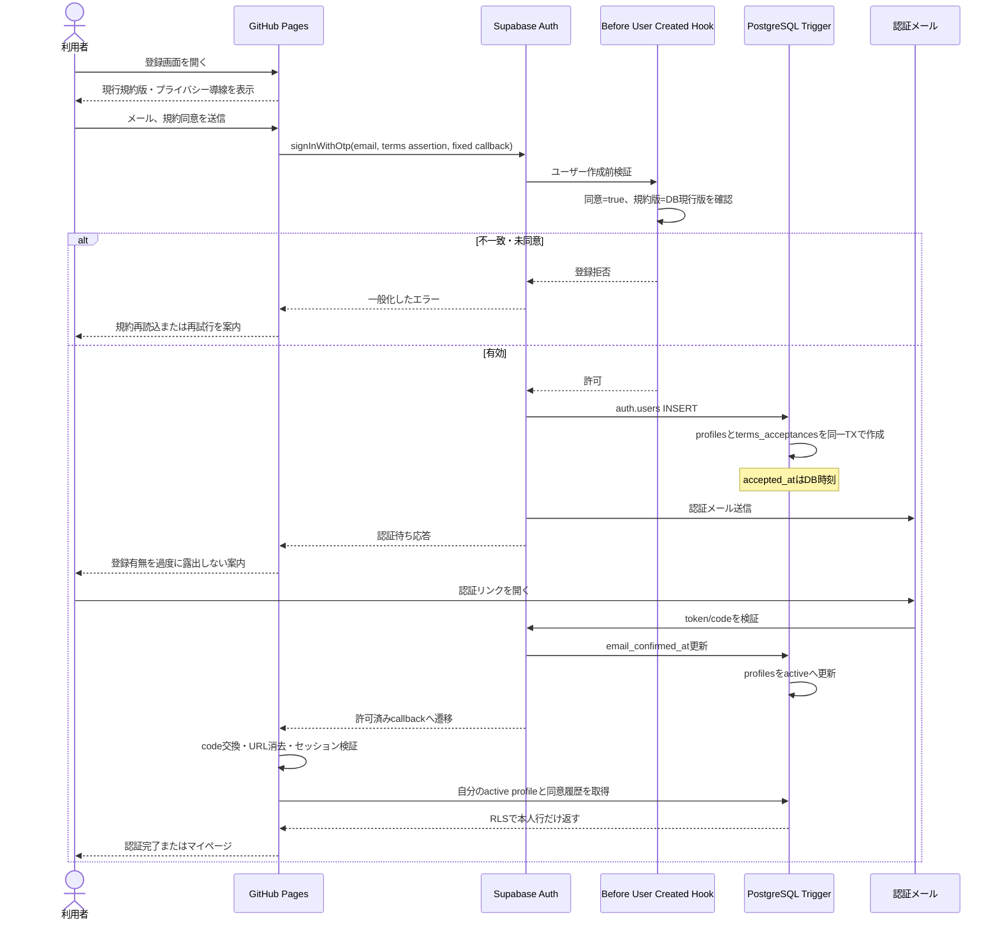
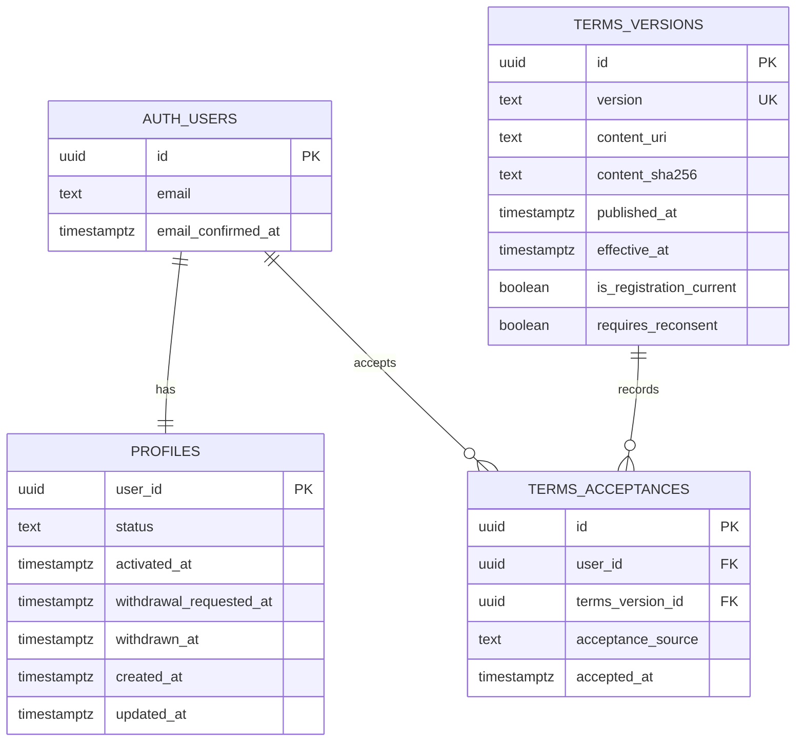

# Phase 1 会員登録・利用規約同意・メール認証 技術設計

## 0. 文書情報

| 項目 | 内容 |
| --- | --- |
| 対象 | Tennis Court Watcher Phase 1 会員基盤 |
| 状態 | 方針決定済み・静的フロントエンド基盤実装中。未確定事項は「**要決定**」と記載する |
| 作成日 | 2026-08-04 |
| 方針決定日 | 2026-08-04 |
| 前提文書 | [Project Vision](./PROJECT_VISION.md)、[Development Roadmap](./DEVELOPMENT_ROADMAP.md)、[Service Specification](./SERVICE_SPECIFICATION.md) |

本書はPhase 1の実装境界、認証・認可、データ、画面、テスト、段階導入を定義する。Supabase Auth/PostgreSQLを正式採用し、GitHub Pages上の静的フロントエンドからブラウザ公開用キーで接続する。リージョン、料金枠など明記した項目は引き続き**要決定**である。

### 0.1 決定済み事項

| 決定事項 | 決定内容 | 決定日 |
| --- | --- | --- |
| 会員基盤 | Supabase Auth/PostgreSQLを正式採用する | 2026-08-04 |
| 認証方式 | メールのマジックリンクを使用し、パスワード認証はPhase 1で使用しない | 2026-08-04 |
| ホスティング | GitHub Pagesを継続する | 2026-08-04 |
| 法務ページ | 会員登録の一般公開前に利用規約とプライバシーポリシーの暫定初版を作成し、内容確認を完了する | 2026-08-04 |
| Phase 1範囲 | 利用規約同意、会員登録、メール認証、ログイン、ログアウト、最小限のマイページ、退会に限定する | 2026-08-04 |
| Phase 1対象外 | 通知条件、利用者別通知、LINE連携、課金は実装しない | 2026-08-04 |

## 1. 現在の構成と制約

### 1.1 現行Phase 0

現在の稼働系は次の構成である。

- ルートの `index.html` はフレームワークやビルドを必要としない静的ページであり、相対URLの `data/availability.json` を読み込む。
- `scripts/scrape.py` はPython/Playwrightで鹿児島市の3施設を取得し、公開用 `data/availability.json` と既存LINE通知用 `data/notification-state.json` を生成する。
- 既存LINE通知は `LINE_CHANNEL_ACCESS_TOKEN` と単一の `LINE_USER_ID` をGitHub Actions Secretsから受け取る。これは利用者別通知ではない。
- `.github/workflows/update-availability.yml` はpytest、スクレイピング、診断Artifact、2つのJSONの更新、GitHub Pagesデプロイを行う。
- Pagesのデプロイ対象は現在、`index.html` と `data/availability.json` だけである。
- `tests/` はスクレイピング、DOM変更・403時の障害分離、秘密情報のマスク、差分LINE通知、Pages表示、モバイル表示、workflowの安全な実行条件を検証している。
- フロントエンド用のパッケージ管理・ビルド処理、認証バックエンド、会員データベースはまだ存在しない。
- 現在の `.gitignore` は `.env` 系ファイルを除外していない。実装開始前に追加が必要である。

### 1.2 Phase 1で守る境界

Phase 1は次を不変条件とする。

1. 既存の `index.html`、公開JSONのスキーマと相対パスを変更しない。
2. `scripts/scrape.py` に会員・認証・個人情報への依存を追加しない。
3. `data/availability.json` と `data/notification-state.json` に会員情報を追加しない。
4. 既存LINE通知のSecret、通知先、差分判定、再試行方針を変更しない。
5. 会員基盤の障害時も、Phase 0の取得・表示・既存LINE通知を継続できる。
6. Pages Artifact、Actions Artifact、リポジトリ、Issue、テストfixtureへ個人情報を保存しない。
7. GPS位置情報を取得せず、地域制限にも使用しない。

### 1.3 GitHub Pages固有の制約

- サーバー側レンダリング、任意のAPI処理、HTTP-only Cookieの発行はGitHub Pages単体では行えない。
- GitHub Pagesのプロジェクトサイトでは、公開URLにリポジトリ名のベースパスが入る可能性がある。サイト内リンクを `/auth/login.html` のようなドメインルート固定にせず、相対URLで記述する。
- 保護ページのHTML/JavaScript自体は誰でも取得できる。「画面を隠すこと」を認可にせず、データ取得時のRLSを最終的な認可境界にする。
- ブラウザ実行のためセッションはJavaScriptから利用可能なストレージに保持される。XSS対策、依存関係固定、認証画面からの第三者スクリプト排除が必須である。HTTP-only Cookieを必須要件とする場合はGitHub Pagesのみの構成では満たせず、ホスティング構成を再検討する必要があるため**要決定**とする。
- GitHub Pagesでは任意のレスポンスヘッダーを設定できない。CSPはHTMLの `meta` で可能な範囲を適用するが、`frame-ancestors` などレスポンスヘッダーが必要な対策をどう補うかは**要決定**である。

## 2. Phase 1の対象機能

| 機能 | Phase 1の範囲 |
| --- | --- |
| 新規会員登録 | メールアドレスを入力し、現行利用規約へ明示的に同意してマジックリンク送信を開始する |
| 利用規約への同意 | チェックを初期OFF・必須とし、規約バージョンとDB時刻による同意日時を履歴保存する |
| プライバシーポリシーの確認 | 登録前に到達しやすい公開ページとリンクを提示する。別途同意チェックを必須にするかは**要決定** |
| メール認証 | マジックリンクメール、認証待ち、再送、成功、期限切れ・無効リンク時の再試行導線を提供する |
| ログイン | メール認証済みかつ有効な会員が、メールアドレスへ届くマジックリンクでログインする |
| ログアウト | 現在のセッションを終了し、会員情報を画面から消去して公開画面へ戻る |
| 最小限のマイページ | 自分の会員状態、メール認証状態、同意規約バージョン・日時、問い合わせ、ログアウト、退会導線を表示する |
| 退会 | 本人確認後に会員を即時ロックし、サーバー側の特権処理でAuthユーザーと個人情報を削除または規定に従って匿名化する |

パスワード認証とパスワード再設定はPhase 1の対象外とする。表示名、メールアドレス変更、全端末ログアウトをPhase 1へ含めるかは**要決定**である。

## 3. Phase 1の対象外

- 通知条件設定
- 利用者別メール通知
- LINEアカウント連携、LINE Login、利用者別LINE通知
- 有料プラン、決済、契約管理
- ソーシャルログイン、多要素認証
- 自動予約、予約代行
- GPSによる地域判定・地域制限
- 本格的な管理画面
- Phase 0のスクレイパー、公開JSON、既存LINE通知のDB移行

認証メールはPhase 1に含むが、空き情報を送る利用者別メール通知とは責務・配信目的・テンプレートを分離する。

## 4. Supabase Auth・PostgreSQLを利用する構成

### 4.1 決定構成



### 4.2 責務

| コンポーネント | 責務 | 禁止事項 |
| --- | --- | --- |
| GitHub Pages | 登録・認証・ログイン・マイページのUI、公開用キーを使ったAuth/Data API呼び出し | 認可の最終判断、service role/secret keyの保持 |
| Supabase Auth | マジックリンク発行、メール確認、ログイン、セッション、Authユーザー削除 | 利用規約本文の公開元、Phase 0の空き取得 |
| PostgreSQL | プロフィール、規約版、同意履歴、RLS、会員状態 | メールアドレスや認証情報の重複保存 |
| Auth Hook/DB Trigger | 現行規約への同意宣言の検証、プロフィールと同意履歴の同一トランザクション作成、認証完了時の会員有効化 | クライアント送信の同意日時を信用すること |
| Edge Function | 退会など、Auth Admin権限が必要な処理 | 未認証呼び出し、リクエストの `user_id` を信用すること |
| GitHub Actions | 既存Phase 0の更新、将来の静的会員画面のビルド・追加配信 | 本番会員データの取得、service role keyのフロントエンド埋め込み |

### 4.3 Supabaseの初期設定方針

- Emailプロバイダーとマジックリンクを有効化し、パスワードによるログインUIは提供しない。
- メールリンクの検証を必須にする。検証を経ずにセッションを作成できる設定ではリリースしない。
- Anonymous sign-in、OAuth、電話番号認証はPhase 1では無効にする。
- 本番のSite URLとRedirect URLは正確なHTTPS URLを明示登録し、本番では広すぎるワイルドカードを使用しない。
- 開発・ステージング・本番は別プロジェクトに分離する案を推奨する。最低限、本番データをローカルやテストへ複製しない。
- Auth APIのレート制限とCAPTCHAの採否をリリース前に確認する。
- Supabase標準の試用メール送信は本番用途に依存せず、独自SMTPを設定する。配信事業者・ドメインは**要決定**。
- Supabaseのリージョン、料金枠、バックアップ要件、Auth Hookを利用できるプランは**要決定**である。

## 5. GitHub Pagesとの接続方法

### 5.1 接続

ブラウザは、デプロイ時に生成した公開設定から次の値だけを読み、Supabase JavaScriptクライアントを初期化する。

- `SUPABASE_URL`
- `SUPABASE_PUBLISHABLE_KEY`（旧プロジェクトでは公開用 `anon` key）
- `AUTH_CALLBACK_URL`

公開用キーはブラウザに配布される識別値であり、秘密情報として保護できない。したがって、公開スキーマの全テーブルでRLSと最小権限Grantを必須とする。service role keyまたはSupabase secret keyはRLSを迂回するため、ブラウザ、HTML、JavaScript、Pages Artifact、リポジトリへ絶対に置かない。

### 5.2 デプロイの追加方針

実装時も既存Pages生成を置き換えず、次の順で加算する。

1. 現行どおり `_site/index.html` と `_site/data/availability.json` を生成する。
2. Phase 1の静的成果物を `_site/auth/`、`_site/account/`、`_site/legal/`、`_site/assets/` へ追加する。
3. 実接続時に、公開設定ファイルをGitHub Actions Repository Variablesから生成する。
4. Artifact内に既存トップ、公開JSON、Phase 1画面がすべて存在することをテストしてから、現行のPagesジョブでまとめてデプロイする。

会員画面のビルド失敗時に古いPages公開まで停止するか、会員機能だけを無効化してPhase 0を公開するかは**要決定**とする。推奨は、会員機能を機能フラグで無効化でき、Phase 0だけを再デプロイできることとする。

### 5.3 URLとセッション

- SupabaseのRedirect URLには本番・ステージング・ローカルのcallbackを個別登録する。
- callbackは許可済みの固定パスだけを使い、クエリから任意の遷移先を受け取らない。
- 認証コード、token hash、エラー情報を処理した直後に `history.replaceState` でURLから除去し、画面・console・分析基盤へ渡さない。
- 認証ページでは `Referrer-Policy: no-referrer` 相当を適用し、認証処理中のURLを外部へ送らない。
- 認証方式はメールのマジックリンクとする。マジックリンクのトークン交換方式としてPKCEを採用するか、別端末でリンクを開く利用者体験をどう扱うかは**要決定**である。
- access tokenとrefresh tokenをURL fragmentへ露出させるimplicit flowは採用候補から除外する。
- 認証URL、access token、refresh token、PKCE verifier、認証コードをログへ出さない。URL全体をエラー監視へ送る設定も禁止する。

## 6. 推奨ディレクトリ構成

既存ファイルを維持したまま、次を追加する案とする。

```text
.
├── index.html                         # Phase 0。変更しない
├── data/                              # Phase 0公開データ・通知状態
├── scripts/                           # Phase 0スクレイパー
├── tests/                             # Phase 0回帰テスト
├── auth/
│   ├── login.html                     # ログイン・会員登録
│   └── callback.html
├── account/
│   └── index.html                     # 最小限のマイページ
├── legal/
│   ├── terms.html
│   └── privacy.html
├── assets/
│   ├── css/auth.css
│   ├── js/auth-foundation.js
│   └── config/auth-config.example.js
├── supabase/
│   ├── config.toml
│   ├── migrations/
│   │   ├── <timestamp>_phase1_auth_schema.sql
│   │   ├── <timestamp>_phase1_auth_triggers.sql
│   │   └── <timestamp>_phase1_auth_rls.sql
│   ├── functions/withdraw-account/index.ts
│   └── tests/
│       ├── auth_schema.test.sql
│       └── auth_rls.test.sql
├── tests-auth/
│   ├── unit/
│   └── e2e/
├── package.json
├── package-lock.json
└── docs/PHASE1_AUTH_DESIGN.md
```

今回の静的基盤にはSupabase JavaScript SDKを追加しない。実接続時はSDKのバージョンを固定し、認証画面で未固定CDNスクリプトを実行しない。ビルド成果物をコミットするかActions内だけで生成するかは**要決定**だが、どちらでも再現可能な固定バージョンを使う。

## 7. 画面とURLの構成

次のパスはPagesサイトのベースURLからの相対パスである。たとえばプロジェクトサイトなら、実URLは `https://<owner>.github.io/<repository>/auth/login.html` の形になる。

| 画面 | 相対URL | 公開範囲 | 主な状態 |
| --- | --- | --- | --- |
| 既存空き状況トップ | `./` | 公開 | Phase 0。変更しない |
| 利用規約 | `legal/terms.html` | 公開 | 暫定案。一般公開前に内容、版番号、発効日を確認 |
| プライバシーポリシー | `legal/privacy.html` | 公開 | 暫定案。一般公開前に取得項目、目的、保管、第三者提供、問い合わせを確認 |
| 新規会員登録・ログイン | `auth/login.html` | 公開 | メール入力、規約同意、マジックリンク送信 |
| メール認証callback | `auth/callback.html` | 公開 | 処理中、成功、期限切れ、無効、再送 |
| マイページ | `account/index.html` | 認証・有効会員限定 | 本人の状態、規約同意、ログアウト、退会導線 |

未認証者が `account/index.html` を開いた場合は、保護情報を描画せずログインへ遷移する。遷移先を保持する場合も、サイト内の許可済みパスだけを識別子で指定し、外部URLを受け付けない。

## 8. 会員登録からメール認証完了までのシーケンス



### 8.1 一貫性

- 登録画面は同意チェックなしで送信ボタンを有効にしないが、クライアント検証だけに依存しない。
- `Before User Created Hook` は `terms_accepted=true` と現行の `terms_version` をDB側で検証する。規約改定直後の古い画面からの登録は拒否し、再読込を案内する。
- `auth.users` のafter insert triggerは、`profiles` と `terms_acceptances` を同じDBトランザクションで作成する。どちらかに失敗した場合はユーザー作成も失敗させる。
- `user_metadata` は利用者が変更可能なので認可判断には使用しない。登録時の同意宣言の入力としてのみ扱い、確定記録は変更不能な同意履歴へ保存する。
- `accepted_at` をクライアントから受け取らず、DBの `timestamptz` デフォルトで記録する。
- メール認証完了は `auth.users.email_confirmed_at` を正とし、DB triggerで `profiles.status` を `active` にする。Confirm Email無効化を前提にしない。
- trigger障害は登録自体を止め得るため、ローカル・ステージングで異常系まで検証してから本番反映する。

### 8.2 エラー表示

- 「登録済み」「メールが存在しない」「未認証」を第三者が判別しやすい文言にしない。
- メール認証待ち画面へメールアドレスを渡す場合はメモリ内またはマスク済み表示に限定し、URL、ログ、HTMLへ埋め込まない。
- 再送はSupabase側のレート制限に加え、ボタンの待機時間を設ける。具体値は**要決定**。

## 9. データモデル

### 9.1 Phase 1論理モデル



### 9.2 設計原則

- メールアドレスと認証情報は `auth.users` だけに保持し、`profiles` へ重複保存しない。
- 日時はすべて `timestamptz`、保存時はUTC、表示時は利用者向けタイムゾーンで変換する。
- `auth.users.id` と各テーブルの `user_id` を唯一の会員結合キーにする。
- 規約本文は公開可能な版管理ファイルとしてGit管理し、DBには版、公開URI、SHA-256ハッシュを保存する。公開済み版は上書きせず、新版を追加する。
- IPアドレスとUser-Agentを同意証跡に保存するかは、証跡価値と個人情報最小化を比較して**要決定**とする。既定案はPhase 1では保存しない。
- プライバシーポリシーも版管理する。確認履歴を別テーブルへ保存するか、同意ではなく提示記録だけとするかは法務確認後に**要決定**とする。

## 10. `profiles` テーブル案

テーブル名は既存仕様の `user_profiles` ではなく、Supabaseの一般的な構成に合わせて `public.profiles` とする案である。正式名称はマイグレーション作成時に**要決定**とする。

| 列 | 型 | NULL | 制約・用途 |
| --- | --- | --- | --- |
| `user_id` | `uuid` | 不可 | PK、`auth.users(id)` FK。削除方針決定後に `ON DELETE CASCADE` を設定 |
| `status` | `text` | 不可 | `pending_email_verification`、`active`、`withdrawal_pending`、`suspended`、`withdrawn` のCHECK |
| `activated_at` | `timestamptz` | 可 | 最初のメール認証完了時のDB時刻 |
| `withdrawal_requested_at` | `timestamptz` | 可 | 退会ロック開始時刻 |
| `withdrawn_at` | `timestamptz` | 可 | 論理保持する場合の退会完了時刻 |
| `created_at` | `timestamptz` | 不可 | DB default `now()` |
| `updated_at` | `timestamptz` | 不可 | DB triggerで更新 |

Phase 1で編集可能なプロフィール項目は設けないことを初期案とする。表示名を収集する必要性は**要決定**であり、目的が確定するまで列を追加しない。メール認証時刻は `auth.users.email_confirmed_at` を正とし、マイページでは本人のAuth user情報から表示する。

`status` はクライアントから更新できない。登録・認証trigger、退会Edge Function、運用者の管理手順だけが更新する。

## 11. 利用規約同意履歴の保持方法

### 11.1 `terms_versions`

- `version` は人が識別できる不変の文字列とする。形式は日付版かSemVerか**要決定**。
- `content_uri` は対応する固定版規約ページを指す。
- `content_sha256` は公開した本文の同一性確認に使う。
- `is_registration_current=true` は同時に1件だけになる部分一意制約を設ける。
- `effective_at` が未来の版は登録用の現行版にしない。
- 公開後の行は更新せず、訂正も新しい版として追加する。

### 11.2 `terms_acceptances`

| 列 | 型 | 用途 |
| --- | --- | --- |
| `id` | `uuid` | PK、DB生成 |
| `user_id` | `uuid` | `auth.users(id)` FK |
| `terms_version_id` | `uuid` | `terms_versions(id)` FK |
| `acceptance_source` | `text` | `signup` または将来の `reconsent` |
| `accepted_at` | `timestamptz` | DB時刻 |

`unique(user_id, terms_version_id)` を設け、再試行で同一同意を重複させない。同意履歴は利用者が参照できるが、INSERTは登録triggerまたは再同意用の信頼できるDB関数だけ、UPDATE/DELETEは原則禁止とする。規約改定時は過去行を上書きしない。

退会後に同意証跡を保持する期間、匿名化方法、法的必要性は**要決定**である。決定前に本番リリースしない。

## 12. Row Level Securityの方針

1. Data APIから到達できる `public` スキーマの全テーブルでRLSを明示的に有効化する。
2. RLS有効化だけでなく、`anon` と `authenticated` のテーブル・列権限を最小化する。
3. `anon` は公開中の `terms_versions` の公開列だけ参照可能とし、`profiles`、`terms_acceptances` へ一切アクセスさせない。
4. `authenticated` は自分の行だけ参照可能とする。
5. `profiles.status`、会員ライフサイクル日時、`terms_acceptances` はクライアントから更新させない。
6. 全利用者所有テーブルのポリシーは `auth.uid()` と行の `user_id` を比較する。URLやリクエスト本文の `user_id` を認可に使わない。
7. Phase 2以降の利用者所有テーブルでも、所有者が `active` であることを確認する共通方針を採用し、退会ロック直後から既存JWTによるアクセスを拒否する。
8. service role/secret keyを使う処理はRLSを迂回するため、Edge Function内でも利用者JWTを検証し、対象IDを認証済み利用者から導出する。
9. Viewを公開する場合はRLS迂回を避けるため `security_invoker` を検討し、不要なViewは公開スキーマに作らない。
10. RLSポリシー、Grant、trigger、DB関数をマイグレーションとしてレビューし、Dashboard上だけの手作業にしない。

## 13. 認証済みユーザーだけが自分の情報を参照・更新できるポリシー

次は実装時のポリシー形を示す設計例であり、この文書ではDBへ適用しない。

```sql
alter table public.profiles enable row level security;

create policy profiles_select_own_active
on public.profiles
for select
to authenticated
using (
  (select auth.uid()) = user_id
  and status = 'active'
);

create policy profiles_update_own_active
on public.profiles
for update
to authenticated
using (
  (select auth.uid()) = user_id
  and status = 'active'
)
with check (
  (select auth.uid()) = user_id
  and status = 'active'
);
```

RLSは行を制限するが列を制限しない。そのため、Phase 1に利用者編集列がなければ `authenticated` へUPDATE権限を付与しない。将来 `display_name` などを追加する場合だけ、その列へのUPDATEをGrantし、`status`、`user_id`、各ライフサイクル日時は更新不可とする。

同意履歴の本人参照は次の形とし、クライアント用INSERT/UPDATE/DELETEポリシーを作らない。

```sql
alter table public.terms_acceptances enable row level security;

create policy terms_acceptances_select_own_active
on public.terms_acceptances
for select
to authenticated
using (
  (select auth.uid()) = user_id
  and exists (
    select 1
    from public.profiles p
    where p.user_id = (select auth.uid())
      and p.status = 'active'
  )
);
```

ポリシーテストでは、匿名、本人A、本人B、退会処理中、停止済み、メール未認証の各主体を分ける。

## 14. 退会時のデータ処理

### 14.1 推奨フロー

1. 利用者が影響、削除対象、保持対象、再登録可否を確認する。
2. 退会専用マジックリンクの再送など、Supabaseで本人性を再確認する。具体方式は**要決定**。
3. ブラウザが利用者JWT付きで `withdraw-account` Edge Functionを呼ぶ。
4. Edge FunctionはJWTを検証し、リクエスト本文の `user_id` を無視して認証主体のIDを使う。
5. DB関数が `profiles.status=withdrawal_pending` と `withdrawal_requested_at` を設定する。この時点でRLSが本人のデータアクセスを拒否する。
6. Phase 2以降の通知条件・キューが存在する場合は送信対象から外す。Phase 1にはまだ存在しない。
7. Edge Functionだけが保持するsecret/service role権限でAuth Adminのユーザー削除を行う。
8. ハード削除方針なら、FK cascadeで `profiles` と同意履歴を削除する。保持義務がある情報は事前にアクセス制限された非公開スキーマへ最小限・匿名化して移す。
9. ブラウザは成功・既処理のどちらでもローカルセッションと会員表示を消去し、公開トップへ戻る。

### 14.2 障害と冪等性

- 処理は同じ利用者が再送しても安全な状態遷移にする。
- Auth削除に失敗した場合も `withdrawal_pending` のままアクセスと通知を停止し、運用者が再試行できるようにする。
- Authユーザー削除後も、発行済みJWTは有効期限まで暗号学的には有効な場合がある。全ての会員データポリシーで `profiles.status='active'` または有効プロフィールの存在を要求し、この時間差を閉じる。
- 退会APIは利用者ID、メールアドレス、JWTをログへ出さず、個人を直接示さない処理IDと成否コードだけを監査する。
- Supabase Authユーザー削除はサーバー専用処理であり、service role/secret keyをブラウザへ置かない。

### 14.3 リリース前の決定事項

ハード削除かソフト削除か、同意履歴・監査・バックアップの保持期間、バックアップからの消去時期、再登録時の扱い、退会猶予期間は**要決定**である。これらをプライバシーポリシーと運用Runbookへ反映するまで退会機能を本番公開しない。

## 15. 環境変数・設定値の管理方法

| 種別 | 例 | 管理場所 |
| --- | --- | --- |
| ブラウザ公開設定 | Supabase URL、publishable key、callback URL | GitHub Actions Repository Variablesまたは公開設定ファイル |
| Edge Function Secret | Supabase secret/service role key、将来の外部API秘密鍵 | Supabase Edge Function Secrets |
| GitHub Actions Secret | 既存LINE token/user ID、将来Actionsだけが使う秘密値 | GitHub Actions Secrets |
| ローカルSecret | ローカルDB接続、CLI token、テスト用秘密値 | `.env.local` 等のGit管理外ファイル |
| 公開・固定設定 | 規約版、公開法務ページ、スキーマ、RLS migration | Git |

実装開始時に `.gitignore` へ少なくとも次の方針を追加する。

```gitignore
.env
.env.*
!.env.example
assets/config/auth-config.js
supabase/.temp/
```

`assets/config/auth-config.example.js` にはSupabase URL、ブラウザ公開用キー、Auth callback URLの項目と空値だけを置く。実値をコピーしない。公開設定とSecretを同じ変数名やファイルで扱わず、レビュー時に区別できるようにする。

開発・ステージング・本番ごとにSupabaseプロジェクトとcallback URLを分ける案を推奨する。本番の設定をpull requestのpreviewへ配布しない。

## 16. GitHubへ登録してよい値、登録してはいけない秘密情報

### 16.1 登録してよい値

- Supabase project URL
- Supabase publishable key、または旧形式の公開用anon key
- 公開サイトURL、固定callback URL
- 公開する利用規約・プライバシーポリシー本文、版番号、本文ハッシュ
- DB migration、RLS policy、Edge Functionのソースコード
- 変数名だけを示す `.env.example`
- 架空かつ明確にテスト用と分かるメールアドレス
- 個人情報を含まない公開空きデータ

公開用キーを登録できることは、権限が安全という意味ではない。RLS、Grant、レート制限を必須とする。

### 16.2 登録してはいけない値

- Supabase secret key、service role key
- Supabase database password、直接接続文字列
- Supabase Management API token、個人アクセストークン
- SMTP認証情報、メール配信API key
- access token、refresh token、JWT、Cookie、PKCE verifier、認証コード、token hash
- 認証メール本文、認証URL
- 実利用者のメールアドレス、プロフィール、同意履歴、問い合わせ内容
- 本番DB dump、Authユーザーexport、個人情報を含むログ・スクリーンショット・Artifact
- 既存の `LINE_CHANNEL_ACCESS_TOKEN` と `LINE_USER_ID`

## 17. service role keyの禁止事項

- service role keyまたはsecret keyを、`auth/`、`account/`、`legal/`、`assets/`、`index.html`、ブラウザJavaScript、runtime config、source map、Pages Artifactへ含めない。
- `VITE_`、`NEXT_PUBLIC_` 等の公開プレフィックスを付けない。
- GitHub Actionsで静的ファイルへ展開しない。
- テストfixture、console、例外、HTTPレスポンスへ含めない。
- 退会などで必要な場合だけEdge Function Secretsに保存し、利用者JWT検証後の最小処理で使う。
- service roleはRLSを迂回するため、Edge Function内でも対象ユーザーをリクエスト値から選ばない。

## 18. ログ・監視のデータ最小化

メールアドレス、access token、refresh token、JWT、Cookie、Authorization header、認証URL、認証コード、token hash、PKCE verifierをログへ出さない。

- `console.log(error)` のようにSDKエラー全体を出力せず、定義済みの内部エラーコードへ変換する。
- URL全体、query、fragment、request/response bodyをActions、Edge Function、監視サービスへ記録しない。
- ログイン・登録失敗は `auth_signup_failed` のようなイベント名、HTTP分類、個人を直接示さないrequest ID、時刻だけを記録する。
- メールアドレスをマスクしても再識別可能性があるため、原則ログへ出さない。
- callbackは機微なURL要素を消去してから、UI描画、外部リンク表示、計測を行う。
- 認証画面へ広告、行動分析、セッションリプレイ、未知の第三者JavaScriptを載せない。
- source mapを公開する場合でも設定値やトークンが埋め込まれていないことをビルド検査する。

## 19. テスト方針

### 19.1 単体テスト

- 入力検証、規約同意チェック、送信中の二重送信防止
- URLベースパス生成とサイト内redirect allowlist
- SDKエラーから一般化した画面メッセージへの変換
- callbackの成功・期限切れ・改変・使用済み・code不足
- 認証情報をURLとログから除去する処理
- マイページで本人情報だけを表示する処理

### 19.2 DB・RLSテスト

| 主体 | `profiles` | `terms_acceptances` | 公開中の規約版 |
| --- | --- | --- | --- |
| `anon` | 0件、書込不可 | 0件、書込不可 | 公開列のみ参照可 |
| 本人A・active | Aだけ参照 | Aだけ参照 | 参照可 |
| 本人B・active | Aを参照・更新不可 | Aを参照不可 | 参照可 |
| 未認証相当 | 会員データ不可 | 会員データ不可 | 参照可 |
| `withdrawal_pending` | 会員データ不可 | 会員データ不可 | 参照可 |

さらに次を検証する。

- 同意なし、古い規約版、存在しない規約版ではAuth Hookが登録を拒否する。
- 正常登録ではprofileと同意履歴が同時に1件ずつ作成され、同意日時がDB時刻になる。
- trigger失敗時にAuthユーザーだけが残らない。
- メール認証前は `pending_email_verification`、認証後だけ `active` になる。
- `status` と同意履歴を利用者JWTで改変・削除できない。
- 退会ロック後は削除前のJWTでも会員データを取得できない。

### 19.3 結合・E2Eテスト

- 登録→認証メール取得→callback→マイページ→ログアウト
- 規約改定が登録画面表示後に起きた場合の再読込
- 認証メール再送の待機と429応答
- 認証リンクの期限切れ、改変、二回使用
- ログイン失敗、未認証、退会処理中、停止済み
- 直接 `account/index.html` を開いた場合、リロード、ブラウザバック
- GitHub Pagesのリポジトリベースパス配下で全リンクとcallbackが動く
- モバイル幅、キーボード操作、ラベル、フォーカス、色以外のエラー表現
- 退会の成功、二重実行、Auth削除失敗からの再試行
- PKCE採用時は同一端末と別端末でメールを開く挙動を明示的に確認する

ローカルSupabaseとローカルメール受信環境を基本とし、本番データを使わない。本番smoke testは専用の架空アカウントだけで行い、テスト後の削除を確認する。

### 19.4 セキュリティ・漏えいテスト

- build出力、Pages Artifact、Actions Artifact、source mapへの禁止値混入検査
- `.env`、DB dump、runtime SecretのGit追跡防止
- console、Edge Function log、Actions logにメール・トークン・認証URLがないこと
- XSS、オープンリダイレクト、CSP、依存関係改ざん、CSRF相当の状態変更操作
- 公開用キーだけで他利用者データを取得・更新できないこと
- service role keyがフロントエンドbundleに存在しないこと
- 登録、ログイン、再送、退会のレート制限

### 19.5 Phase 0回帰

- 現行の `python -m pytest` を継続して成功させる。
- `index.html` が引き続き `data/availability.json` を相対URLで読み込む。
- Pages Artifactに既存トップと公開JSONが存在する。
- scraper dry-run、基準化、既存LINE通知、JSON commit条件、Pages権限分離を変更しない。
- 会員機能の設定不足・Supabase障害時にもPhase 0のテスト、取得、デプロイが継続する。

## 20. 段階的な実装手順

### Step 0: 要決定事項のうち実装前提を確定

Supabase採用、メールのマジックリンク認証、GitHub Pages継続、Phase 1の機能境界は2026-08-04に決定済みである。環境分離、Pages本番URL、マジックリンクのトークン交換方式、規約・プライバシー本文、退会保持方針は引き続き決定し、必要ならADRへ記録する。

### Step 1: Phase 0を保護する配信・設定の土台

会員画面用の独立ディレクトリ、固定依存関係、公開設定テンプレート、`.env`除外、会員機能フラグ、Pages Artifact構成テストを追加する。既存トップとスクレイパーは変更しない。

### Step 2: Supabaseローカル環境とDB migration

`terms_versions`、`profiles`、`terms_acceptances`、制約、Grant、RLS、Auth Hook、triggerをmigration化する。架空データでRLSテストを作る。

### Step 3: 規約・プライバシー公開画面

版固定の利用規約、現行版導線、プライバシーポリシー、問い合わせ先を静的ページとして追加する。本文ハッシュとDB版を一致させる。

### Step 4: 会員登録と同意記録

登録・ログイン共通画面、入力検証、明示同意、Auth `signInWithOtp`、Hook/trigger、一貫性、一般化したエラー、レート制限を実装する。

### Step 5: メール認証

独自SMTP、固定callback、認証待ち、再送、callback、期限切れ・無効時の導線、URL消去を実装する。

### Step 6: ログイン・ログアウト・マイページ

ログイン、各保護画面のroute guard、本人profileと同意履歴の表示、ログアウトを実装する。未認証・非active会員のデータを描画しない。

### Step 7: 退会

再認証、`withdraw-account` Edge Function、即時ロック、Auth Admin削除、冪等性、失敗時再試行、監査とRunbookを実装する。

### Step 8: 統合・セキュリティ確認

E2E、RLS、漏えい検査、アクセシビリティ、Phase 0回帰、バックアップ・復元、障害対応を確認する。

### Step 9: 段階公開

ステージング、限定公開、本番の順で有効化する。会員機能フラグによる停止とPhase 0のみの再デプロイを確認してから一般公開する。

## 21. 各実装ステップの完了条件

| Step | 完了条件 |
| --- | --- |
| 0 | 実装を左右する要決定事項に決定・理由・決定日があり、規約と退会の運用責任者が明確である |
| 1 | `.env`等が追跡されず、公開設定だけでbuildでき、既存トップ・JSON・pytest・Pages配信が変わらず動く |
| 2 | migrationを空DBへ再適用でき、匿名・他人・退会処理中のアクセスをRLS自動テストが拒否する |
| 3 | 現行版と固定版を公開でき、版・発効日・本文hashが一致し、問い合わせ先と法務確認結果がある |
| 4 | 未同意・古い版では登録できず、正常時だけAuth user・profile・同意履歴が一貫して作られる |
| 5 | 有効リンクだけが認証を完了し、期限切れ・改変・使用済みを拒否し、再送制限とURL/ログ非露出を確認できる |
| 6 | activeな本人だけがマイページを見られ、他人の情報を読書きできず、ログアウト後に保護画面へ戻れない |
| 7 | 退会直後に既存JWTから会員データへアクセスできず、Auth削除・個人情報処理・再試行・監査が方針どおり動く |
| 8 | 正常・主要異常系、RLS、漏えい、アクセシビリティ、既存pytestとPhase 0回帰がすべて成功する |
| 9 | 本番設定・監視・Runbook・ロールバックが確認され、会員機能停止中もPhase 0が継続する |

## 22. 未決事項と判断が必要な項目

次は推測で確定せず、決定まで「要決定」として追跡する。

### 基盤・配信

- Supabaseのリージョン、料金枠、Auth Hook利用可否
- 開発・ステージング・本番のプロジェクト分離方法
- GitHub Pagesの本番URL、リポジトリ名ベースパス、独自ドメインの有無
- フロントエンドのビルド方式、成果物のコミット有無、CSPヘッダーを補う配信方式
- 会員画面ビルド失敗時にPhase 0だけをデプロイする具体方式

### 認証・セッション

- マジックリンクのトークン交換にPKCEを採用する場合の同一ブラウザ・端末制約と、別端末でリンクを開いた場合の案内
- JavaScriptから利用可能なセッションストレージのXSSリスク受容可否
- メールアドレス変更、全端末ログアウト、セッション期間、JWT有効期限
- CAPTCHA、登録・ログイン・再送・退会のレート制限値

### メール

- 本番SMTP/配信事業者、送信元ドメイン、表示名
- SPF、DKIM、DMARC、配信監視、バウンス対応
- 認証リンク有効期限、再送待機、未認証アカウント保持期間
- 同一メールアドレスの再登録と、登録済み推測を防ぐ画面文言

### 規約・個人情報

- 利用規約・プライバシーポリシー本文、運営者表示、問い合わせ先、法務確認
- 規約版番号の形式、発効日、改定告知、重要改定時の再同意
- プライバシーポリシーの確認履歴を保存するか
- IPアドレス・User-Agentを同意証跡として保存するか
- 表示名をPhase 1で収集するか

### 退会・運用

- 退会時の再認証方式、即時削除か猶予期間付きか、Authのhard/soft delete
- 同意履歴、監査ログ、バックアップの保持期間・匿名化・消去時期
- 退会後の同じメールアドレスによる再登録
- 管理者権限、停止・復旧、問い合わせ本人確認、インシデント対応
- 監視サービス、ログ保持期間、個人情報を含まない監査イベント仕様
- バックアップ頻度、復元テスト、目標復旧時間

## 23. 設計上の重要判断

1. Phase 1をPhase 0から責務・URL・データ・障害の面で分離し、既存稼働系へ認証依存を持ち込まない。
2. 静的PagesからSupabaseへ直接接続するのは公開用キーだけとし、RLSを認可の最終境界にする。
3. service role/secret keyが必要な退会処理はEdge Functionへ限定する。
4. 利用規約同意はクライアントUIだけで完結させず、Hookで現行版を検証し、DB triggerで版とDB時刻を変更不能な履歴として保存する。
5. Authのメール確認と `profiles.status=active` の両方を会員有効性に使い、退会ロック後の既存JWTもRLSで拒否する。
6. メールアドレスを `profiles` へ複製せず、GitHub、Pages、Artifact、ログへ個人情報・認証情報を出さない。
7. GPSは取得・保存・認可に使用しない。

## 24. 参考資料

- [Supabase: Passwordless email logins](https://supabase.com/docs/guides/auth/auth-email-passwordless)
- [Supabase: Redirect URLs](https://supabase.com/docs/guides/auth/redirect-urls)
- [Supabase: PKCE flow](https://supabase.com/docs/guides/auth/sessions/pkce-flow)
- [Supabase: Row Level Security](https://supabase.com/docs/guides/database/postgres/row-level-security)
- [Supabase: Securing your data](https://supabase.com/docs/guides/database/secure-data)
- [Supabase: Before User Created Hook](https://supabase.com/docs/guides/auth/auth-hooks/before-user-created-hook)
- [Supabase: User Management](https://supabase.com/docs/guides/auth/managing-user-data)
- [Supabase: Securing Edge Functions](https://supabase.com/docs/guides/functions/auth)
- [Supabase: Auth rate limits](https://supabase.com/docs/guides/auth/rate-limits)
