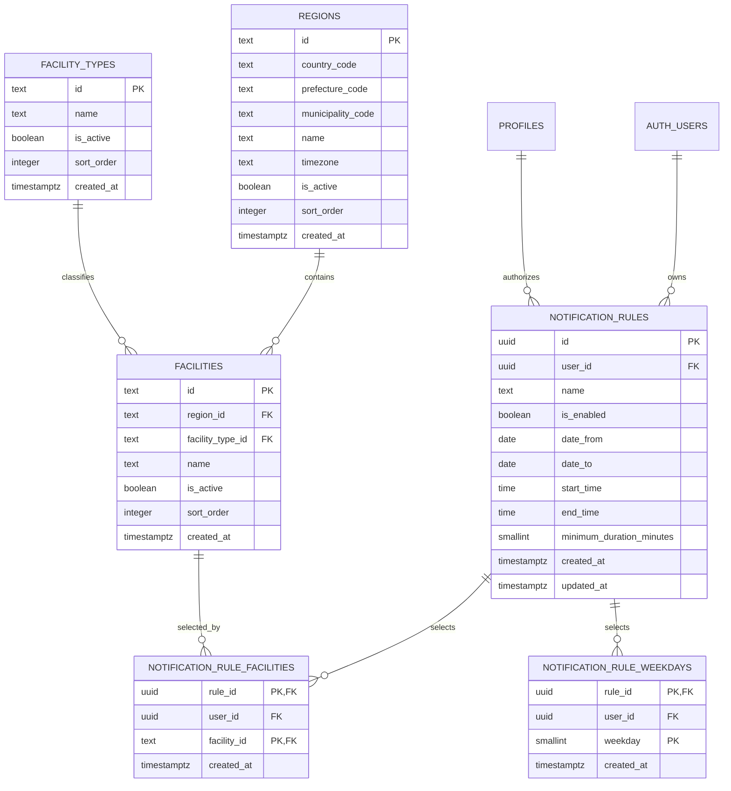

# Phase 2 通知条件データモデル設計

## 1. 目的と責務境界

本書は、Phase 2で使用する地域・施設マスター、利用者ごとの通知条件を保存するデータモデル、通知条件UI、原子的保存RPCを定義する。テーブル・RLS・初期マスターは `supabase/migrations/20260807000000_create_notification_rules.sql`、原子的保存RPCは `supabase/migrations/20260807100000_add_notification_rule_save_rpc.sql` に含める。

Phase 2は進行中である。通知条件の一覧・新規作成・編集・削除・一時停止・有効化UIと、条件本体・施設・曜日を1トランザクションで保存する `save_notification_rule` RPCを実装済みである。空き候補と有効な条件の照合ロジックは未実装である。

Phase 3の責務は、利用者別メール送信、配信キュー、再試行、バウンス・配信停止処理、通知履歴である。実際の利用者別メール送信は未実装であり、Phase 2のテーブルやmigrationへ含めない。

## 2. テーブル一覧

| テーブル | 種別 | 用途 |
| --- | --- | --- |
| `public.regions` | マスター | 国・都道府県・市区町村とタイムゾーン |
| `public.facility_types` | マスター | テニスコートなどの施設種別 |
| `public.facilities` | マスター | 利用者が通知条件で選択する施設 |
| `public.notification_rules` | 利用者データ | 通知条件の本体 |
| `public.notification_rule_facilities` | 利用者データ | 通知条件と施設の多対多関連 |
| `public.notification_rule_weekdays` | 利用者データ | 通知条件と曜日の多対多関連 |

## 3. ER関係

`profiles` はPhase 1の既存テーブルである。RLSは `profiles.id` と認証利用者を照合し、`membership_status = 'active'` の本人だけに利用者データの操作を許可する。

## 4. カラム定義

### 4.1 `regions`

| カラム | 意味 |
| --- | --- |
| `id` | 表示名から独立した安定地域ID |
| `country_code` | ISO 3166-1 alpha-2形式の国コード。初期値は `JP` |
| `prefecture_code` | 都道府県コード。鹿児島県は `46` |
| `municipality_code` | 市区町村コード。鹿児島市は `46201` |
| `name` | 地域表示名 |
| `timezone` | 条件時刻の評価に使うIANAタイムゾーン |
| `is_active` | 新規選択肢として使用可能か |
| `sort_order` | UI表示順 |
| `created_at` | DB登録時刻 |

すべての文字列列は空白だけの値を許可しない。初期地域は `jp-kagoshima-kagoshima-city` である。

### 4.2 `facility_types`

| カラム | 意味 |
| --- | --- |
| `id` | 安定施設種別ID |
| `name` | 施設種別表示名 |
| `is_active` | 新規選択肢として使用可能か |
| `sort_order` | UI表示順 |
| `created_at` | DB登録時刻 |

初期種別は `tennis-court`（テニスコート）である。地域と施設種別を別マスターにすることで、将来の地域・体育館・野球場・会議室などを追加できる。

### 4.3 `facilities`

| カラム | 意味 |
| --- | --- |
| `id` | `availability.json` と共有する安定施設ID |
| `region_id` | 所属地域 |
| `facility_type_id` | 施設種別 |
| `name` | 施設表示名 |
| `is_active` | 新規通知条件で選択可能か |
| `sort_order` | UI表示順 |
| `created_at` | DB登録時刻 |

### 4.4 `notification_rules`

| カラム | 意味 |
| --- | --- |
| `id` | DB生成の通知条件UUID |
| `user_id` | 所有者である `auth.users.id` |
| `name` | 利用者が識別する条件名。空白不可、80文字以内 |
| `is_enabled` | 照合対象として有効か。初期値は `false` |
| `date_from` | 対象開始日。`null` は開始日の下限なし |
| `date_to` | 対象終了日。`null` は終了日の上限なし |
| `start_time` | 対象時間帯の開始 |
| `end_time` | 対象時間帯の終了 |
| `minimum_duration_minutes` | 必要な最低連続時間。30〜720分の30分単位 |
| `created_at` | DB登録時刻 |
| `updated_at` | DB triggerで更新する最終更新時刻 |

時刻はタイムゾーンを列自体に持たない。照合時には、選択された施設が属する `regions.timezone` を使用して解釈する。複数施設を選ぶ場合も施設ごとの地域タイムゾーンで個別に評価する。

`is_enabled` の初期値を `false` とするのは、本体作成後に施設と曜日を登録する間の不完全な条件が誤って有効扱いになることを防ぐためである。

### 4.5 `notification_rule_facilities`

| カラム | 意味 |
| --- | --- |
| `rule_id` | 通知条件ID |
| `user_id` | 通知条件の所有者ID |
| `facility_id` | 選択施設ID |
| `created_at` | DB登録時刻 |

主キーは `(rule_id, facility_id)` とする。`(rule_id, user_id)` から `notification_rules(id, user_id)` への複合外部キーにより、別利用者の通知条件へ施設を紐付けられない。

### 4.6 `notification_rule_weekdays`

| カラム | 意味 |
| --- | --- |
| `rule_id` | 通知条件ID |
| `user_id` | 通知条件の所有者ID |
| `weekday` | ISO 8601曜日番号 |
| `created_at` | DB登録時刻 |

主キーは `(rule_id, weekday)` とする。施設関連と同様の複合外部キーにより所有者整合性を保証する。

曜日はISO 8601に従う。

| 値 | 曜日 |
| --- | --- |
| 1 | 月曜日 |
| 2 | 火曜日 |
| 3 | 水曜日 |
| 4 | 木曜日 |
| 5 | 金曜日 |
| 6 | 土曜日 |
| 7 | 日曜日 |

DBのcheck制約で1〜7だけを許可する。

## 5. 施設IDと公開空きデータ

施設マスターのID・名称は `scripts/scrape.py` および `data/availability.json` と一致させる。別名や独自IDを作らない。

| `facilities.id` / `availability.json.facility_id` | 施設名 |
| --- | --- |
| `kamoike-prefectural` | 鴨池県営テニスコート |
| `sumizei` | SuMIzeiテニスコート |
| `toukai-tennis` | 東開庭球場 |

3施設はいずれも地域 `jp-kagoshima-kagoshima-city`、施設種別 `tennis-court` に属する。

## 6. 整合性と未完成条件

DBは文字列、時間順序、日付範囲、最低連続時間、曜日、外部キー、所有者の整合性を保証する。一方、通知条件本体を作ってから子テーブルを登録できるよう、施設または曜日が0件の不完全な条件もDB上は保存可能とする。

Phase 2のUIと `save_notification_rule` RPCは、保存完了前に施設1件以上、曜日1件以上を必須検証する。UIは停止中の条件を有効化する前にも、現在読み込んでいる施設・曜日がそれぞれ1件以上あることを確認する。将来の照合処理でも、施設または曜日が0件の条件を `is_enabled` の値にかかわらず無効として扱う。

利用者ごとの条件数上限と無料プランの上限は未決定であり、現行UIとmigrationには実装しない。

## 7. RLSと権限

6テーブルすべてでRLSを有効にする。RLSに加え、テーブル権限をいったん `PUBLIC`、`anon`、`authenticated` から剥奪して必要最小限だけ再付与する。

マスター3テーブルは `authenticated` にSELECTだけを許可する。`anon` は参照できず、ブラウザの認証利用者もINSERT、UPDATE、DELETEできない。

利用者データ3テーブルは、各SELECT、INSERT、UPDATE、DELETE policyで次の両方を確認する。

- `(select auth.uid()) = user_id` で本人所有行である。
- 本人の `public.profiles.membership_status = 'active'` である。

INSERTは `WITH CHECK`、UPDATEは `USING` と `WITH CHECK`、DELETEは `USING` を使用する。UPDATE後にも本人IDを検証するため、`user_id` を他人へ変更できない。子テーブルではRLSに加えて `user_id` を含む複合外部キーを使用し、親条件との所有者整合性をDB制約でも保証する。

active確認は既存 `profiles` の本人SELECT RLSを利用した単純な `exists` で行う。既存RLSの無効化・緩和や、新しい `security definer` 関数は行わない。

`save_notification_rule` は `security invoker`、`set search_path = ''` のまま実行し、利用者ID引数を受け取らない。新規作成では `auth.uid()` を `user_id` に使用し、編集では条件IDと `auth.uid()` の両方に一致する本人所有行だけを更新する。本体・施設・曜日の全保存が成功した場合だけ条件IDを返し、途中の例外ではRPC呼び出し全体をロールバックする。実行権限は `PUBLIC` と `anon` から剥奪し、`authenticated` だけへ付与する。

## 8. migrationの適用とロールバック

通知条件テーブルmigrationの後に、原子的保存RPC migrationを1回だけ適用する。適用済みmigrationを編集・再実行せず、修正が必要な場合は新しいタイムスタンプのmigrationを追加する。

適用前に、対象Supabaseプロジェクトと環境、SQL全文、RLS、Grant、初期データをレビューする。空の検証環境では全migrationを時系列順に適用し、複数の架空ユーザーで本人・他人・inactive会員・anonの操作を実DB検証する。

このmigrationには自動down migrationを用意しない。適用直後かつ利用者データがない検証環境で戻す必要がある場合だけ、子テーブル、`notification_rules`、施設、施設種別、地域の順で依存関係を確認して削除し、triggerと専用functionも削除する。本番データが存在する環境では安易にテーブルをdropせず、バックアップと復元手順を確認したうえで前方修正migrationを優先する。

本リポジトリへのmigration追加だけではSupabase環境へ自動適用されない。適用状況は対象環境ごとにmigration履歴を確認し、未適用分だけを時系列順に適用する。
